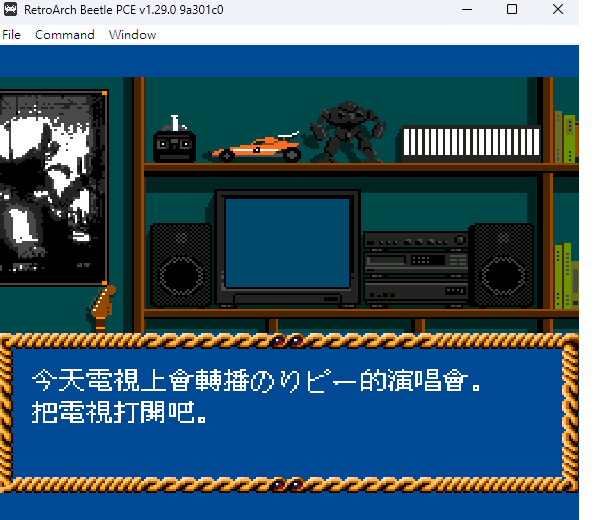
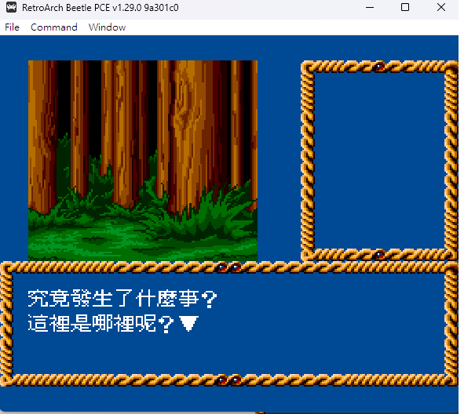
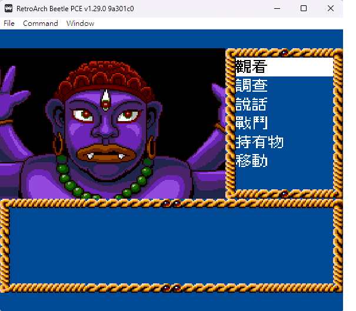
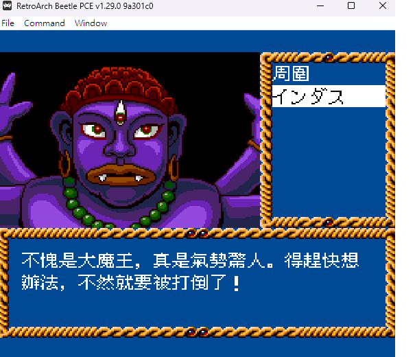

# -Kagami-no-Kuni-no-Legend-Traditional-Chinese-Localization-
PC Engine CD-ROM 鏡の國のレジェンド/Kagami no Kuni no Legend (TurboGrafx-16) Traditional-Chinese-Localization \
繁體中文化

### 說明：
syscard3.pce md5 38179df8f4ac870017db21ebcbf53114\
用 syscard3.ips 更新加入繁體中文的字庫

Kagami no Kuni no Legend (Japan) (Track 2).bin \
md5 e9ba086ac9b9ed71277c99ca77ecbc04
redump 的版本 \
用 Kagami no Kuni no Legend (Japan) (Track 2).ips 更新。

所有的翻譯都是由 CHATGPT/COPILOT完成。對話難免有奇怪的地方。\
另外斷行斷字也有部份問題 \
有想要精進的朋友可 PULL 修改後 dialog.json 。我適當時間上新的 IPS

### 2026/02/10
目前繁體化大概有 99% ，但仍有少數幾個字亂碼。\
但這些不影響劇情的解讀。
個人有重頭打過1次。可完整過關。

## 俢正工具 WinIPS 下載
https://www.romhacking.net/utilities/953/

## 實際遊玩畫面

